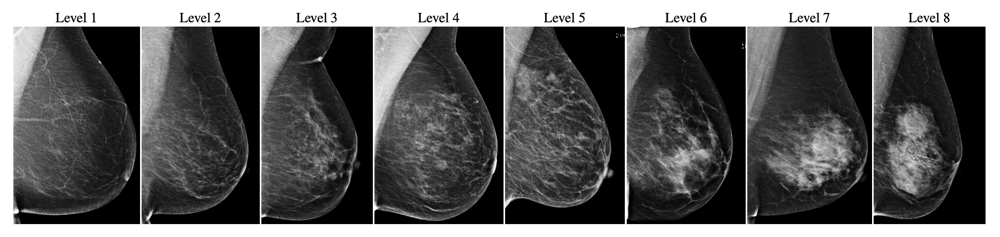

# CSAW-M
This repository contains code for [_CSAW-M: An Ordinal Classification Dataset for Benchmarking Mammographic Masking of Cancer_](https://openreview.net/forum?id=nlJ1rV6G_Iq). Source code for training models to estimate the mammographic masking level along with the checkpoints are made available here.  
The repo containing the annotation tool developed to annotate CSAW-M could be found [here](https://github.com/MoeinSorkhei/CSAW-M_Annotation_Tool).  

  

Our work is licensed [CC BY-NC-ND 4.0](https://creativecommons.org/licenses/by-nc-nd/4.0/).  
_---- This repo is under construction and is contunusously being updated! ----_. 

### Training
In order to train a model, please refer to `scripts/train.sh` where we have prepared commands and arguments to train a model. In order to encourage reproducibility, we also provide the cross-validation splits that we used in the project (please refer to the dataset website to access them). `scripts/cross_val.sh` provides example commands to run cross-validation.

### Evaluation
In order to evaluate a trained model, please refer to `scripts/eval.sh` with example commands and arguments to evaluate a model.

### Important arguments
- `--train` and `--evaluate` which should be used in training and evaluating models respectively.
- `--model_name`: specifies the model name, which will then be used for saving/loading checkpoints  
- `--loss_type`: defines which loss type to train the model with. It could be either `one_hot` which means training the model in a multi-class setup under usual cross entropy loss, or `multi_hot` which means training the model in a multi-label setup using multi-hot encoding (defined for ordinal labels). Please refer to paper for more details.  
- `--img_size`: specifies the image size to train the model with.  
- Almost all the params in `params.yml` could be overridden using the corresponding arguments. Please refer to `main.py` to see the corresponding args.

### Other notes
- It is assumed that `main.py` is called from _inside_ the `src` directory.
- It is important to note that in the beginning of the main script, after reading/checking arguments, `params` defined in `params.yml`is read and updated according to `args`, after which a call to the `set_globals` (defined in `main.py`) is made. This sets global params needed to run the program (GPU device, loggers etc.) For every new high-level module (like `main.py`) that accepts running arguments and calls other modules, this function shoud be called, as other modules assume that these global params are set.
- By default, there is no suggested validation csv files, but in cross-validation (using `--cv`) the train/validation splits in each fold are extracted from the `cv_files` paths specified in `params.yml`.

### Trained models
You can download the trained models from: https://kth.box.com/s/poqjqhwnx86rb6irpjhudvntz22zksqj. Please refer to `main.py` to see how to use a trained model for evaluation.
